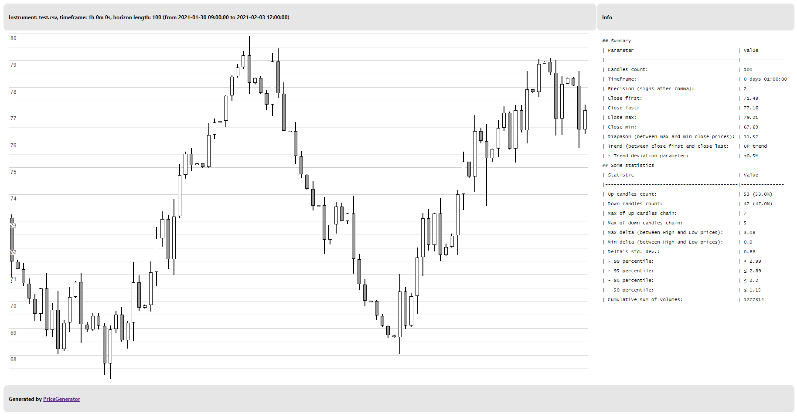
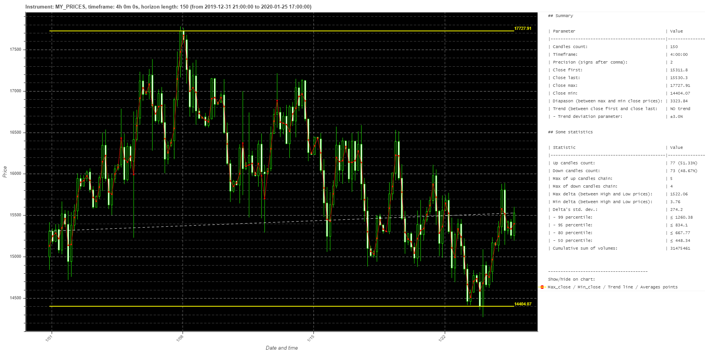

# PriceGenerator


See russian readme here (инструкция на русском здесь): https://github.com/Tim55667757/PriceGenerator/blob/master/README_RU.md

[](https://travis-ci.com/Tim55667757/PriceGenerator)
[](https://pypi.python.org/pypi/PriceGenerator)
[](https://github.com/Tim55667757/PriceGenerator/blob/master/LICENSE)

**Contents**

1. [Introduction](#Introduction)
   - [Price generation method](#Price-generation-method)
2. [Setup](#Setup)
3. [Usage examples](#Usage-examples)
   - [Command line](#Command-line)
     - [Reference](#Reference)
     - [Generating prices with default parameters](#Generating-prices-with-default-parameters)
     - [Generating prices, getting statistics and drawing a chart](#Generating-prices-getting-statistics-and-drawing-a-chart)
     - [Statistics and chart from saved prices](#Statistics-and-chart-from-saved-prices)
     - [Statistics and chart on a simple template](#Statistics-and-chart-on-a-simple-template)
     - [Overriding parameters](#Overriding-parameters)
   - [Module import](#Module-import)


## Introduction

Sometimes, for testing automated trading algorithms, it is necessary to obtain a dataset with exchange prices. Usually traders and analysts use a price model like OHLCV-candlesticks (open, high, low, close, volume), the so-called Japanese candlesticks. One line of such data is a set of prices for constructing one Japanese candlestick: the opening date, the opening price, the highest price, the lowest price, the closing price at a given time interval and the value of the trading volume.

**PriceGenerator** is a simple library that can be used as a python module or run from the command line and generate random price data that is as close as possible to "real prices", but with predefined statistical characteristics. You can set the price interval, timeframe, maximum and minimum values for the price range, maximum size of candles, probability of direction for the next candle, probability of price outliers, the number of generated candles, and some other parameters.

For further statistical analysis of prices in python, the Pandas library is very often used. Prices stored as a Pandas DataFrame might look something like this:
```text
                    datetime   open   high    low  close  volume
95 2021-02-03 11:00:00+03:00  76.82  78.43  76.21  78.13   33652
96 2021-02-03 12:00:00+03:00  78.13  78.37  78.12  78.36    9347
97 2021-02-03 13:00:00+03:00  78.36  78.40  78.05  78.07   27250
98 2021-02-03 14:00:00+03:00  78.07  78.61  75.72  76.42   22979
99 2021-02-03 15:00:00+03:00  76.42  77.37  76.25  77.16   30845
```

The PriceGenerator library allows you to:
- save generated prices in .csv-format (example: [./media/test.csv](./media/test.csv));
- save the generated prices to a Pandas DataFrame variable for further use in automation scripts;
- automatically calculate some statistical and probabilistic characteristics of the generated prices and save them in markdown format (example: [./media/index.html.md](./media/index.html.md));
- load the prices of real instruments according to the OHLCV-candlesticks model from the .csv file and carry out their statistical analysis;
- draw a chart of generated or loaded real prices and save it in html-format (example: [./media/index.html](./media/index.html));
  - generated prices, a chart and some data on price behavior can be saved as a regular png-image (example: [./media/index.html.png](./media/index.html.png)):

    

    In additionally, you can enable on the chart some popular indicators (moving averages, Bollinger bands, ZigZag and others).

### Price generation method

A set of candles of a given length `horizon` is generated according to the following (simplified) algorithm:
1. The open price of the first candlestick is determined or randomly generated in the specified range [`minClose`, `maxClose`].
2. Randomly, depending on the value of the probability of the next candlestick `upCandlesProb` (50% by default), the direction of the candlestick is determined. If `random () ≤ upCandlesProb`, then an up candle (with `open ≤ close`) will be generated, otherwise a down candle (with `open > close`) will be generated.
3. After determining the direction, the `close` value of the candlestick is randomly generated and for the candle's "body" must be `|open - close| ≤ maxCandleBody`.
4. Randomly, depending on the probability of price outliers of the `maxOutlier` candlestick (default is 3%), the candlestick's `high` and `low` values ​​are generated. If `random () ≤ maxOutlier`, then a candlestick with price outliers will be generated: the "tails" of the candlestick may turn out to be large enough to simulate real price "outliers" in the market. If the candlestick is without anomalies, then "tails" will be generated in the range of no more than half of the candlestick body.
5. The close value of the generated candle becomes the open price of the next candle.
6. Then steps 2-5 are repeated until the entire price chain of the specified length `horizon` is generated.

All parameters can be set after initializing an instance of the `PriceGenerator()` class. The result of price generation is saved in the `self.prices` field in the Pandas DataFrame format and can be used for further analysis.


## Setup

The easiest way is to install via PyPI:
```commandline
pip install pricegenerator
```

After that, you can check the installation with the command:
```commandline
pip show pricegenerator
```


## Usage examples

### Command line

#### Reference

Get help:
```commandline
pricegenerator --help
```

Output:
```text
usage: python PriceGenerator.py [some options] [one or more commands]

Forex and stocks price generator. Generates chain of candlesticks with
predefined statistical parameters, return pandas dataframe or saving as .csv-
file with OHLCV-candlestick in every strings. See examples:
https://tim55667757.github.io/PriceGenerator

optional arguments:
  -h, --help            show this help message and exit
  --ticker TICKER       Option: some fake ticker name, 'TEST' by default.
  --precision PRECISION
                        Option: precision is count of digits after comma, 2 by
                        default.
  --timeframe TIMEFRAME
                        Option: time delta between two neighbour candles in
                        minutes, 60 (1 hour) by default.
  --start START         Option: start time of 1st candle as string with format
                        'year-month-day hour:min', e.g. '2021-01-02 12:00'.
  --horizon HORIZON     Option: candlesticks count.
  --split-trend SPLIT_TREND
                        Option: set difference periods, e.g. --split-trend=/\-
                        means that generated candles has up trend at first
                        part, next down trend and then no trend. Used with
                        --split-count key.
  --split-count SPLIT_COUNT [SPLIT_COUNT ...]
                        Option: set count of candles of difference periods,
                        e.g. --split-count 5 10 15 means that generated
                        candles has 3 trends with 5, 10 and 15 candles in
                        chain, with sum equal to --horizon. Used with --split-
                        count and --horizon keys.
  --max-close MAX_CLOSE
                        Option: maximum of all close prices.
  --min-close MIN_CLOSE
                        Option: minimum of all close prices.
  --init-close INIT_CLOSE
                        Option: generator started 1st open price of chain from
                        this 'last' close price.
  --max-outlier MAX_OUTLIER
                        Option: maximum of outlier size of candle tails, by
                        default used (max-close - min-close) / 10.
  --max-body MAX_BODY   Option: maximum of candle body sizes: abs(open -
                        close), by default used max-outlier * 0.9.
  --max-volume MAX_VOLUME
                        Option: maximum of trade volumes.
  --up-candles-prob UP_CANDLES_PROB
                        Option: float number in [0; 1] is a probability that
                        next candle is up, 0.5 by default.
  --outliers-prob OUTLIERS_PROB
                        Option: float number in [0; 1] is a statistical
                        outliers probability (price 'tails'), 0.03 by default.
  --trend-deviation TREND_DEVIATION
                        Option: relative deviation for trend detection, 0.005
                        mean ±0.005 by default. 'NO trend' if (1st_close -
                        last_close) / 1st_close <= trend-deviation.
  --zigzag ZIGZAG       Option: relative deviation to detection points of
                        ZigZag indicator, 0.03 by default.
  --sep SEP             Option: separator in csv-file, if None then auto-
                        detecting enable.
  --debug-level DEBUG_LEVEL
                        Option: showing STDOUT messages of minimal debug
                        level, e.g., 10 = DEBUG, 20 = INFO, 30 = WARNING, 40 =
                        ERROR, 50 = CRITICAL.
  --load-from LOAD_FROM
                        Command: Load .cvs-file to Pandas dataframe. You can
                        draw chart in additional with --render-bokeh key.
  --generate            Command: Generates chain of candlesticks with
                        predefined statistical parameters and save stock
                        history as pandas dataframe or .csv-file if --save-to
                        key is defined. You can draw chart in additional with
                        --render-bokeh key.
  --save-to SAVE_TO     Command: Save generated or loaded dataframe to .csv-
                        file. You can draw chart in additional with --render-
                        bokeh key.
  --render-bokeh RENDER_BOKEH
                        Command: Show chain of candlesticks as interactive
                        Bokeh chart. See: https://docs.bokeh.org/en/latest/doc
                        s/gallery/candlestick.html. Before using this key you
                        must define --load-from or --generate keys.
  --render-google RENDER_GOOGLE
                        Command: Show chain of candlesticks as not interactive
                        Google Candlestick chart. See: https://developers.goog
                        le.com/chart/interactive/docs/gallery/candlestickchart
                        . Before using this key you must define --load-from or
                        --generate keys.
```

#### Generating prices with default parameters

Let's try to generate random price data (key `--generate`) with all default parameters and save them to the file `test.csv` (key `--save-to csv_file_name`). The command might look like this:
```commandline
pricegenerator --debug-level 10 --generate --save-to test.csv
```

You should get the output of logs similar to the following:
```text
PriceGenerator.py   L:605  DEBUG   [2021-01-31 17:52:49,954] =--==--==--==--==--==--==--==--==--==--==--==--==--==--==--==--==--==--==--==--=
PriceGenerator.py   L:606  DEBUG   [2021-01-31 17:52:49,954] PriceGenerator started: 2021-01-31 17:52:49
PriceGenerator.py   L:367  INFO    [2021-01-31 17:52:49,954] Generating prices...
PriceGenerator.py   L:368  DEBUG   [2021-01-31 17:52:49,954] - Ticker name: TEST
PriceGenerator.py   L:369  DEBUG   [2021-01-31 17:52:49,954] - Interval or timeframe (time delta between two neighbour candles): 1:00:00
PriceGenerator.py   L:370  DEBUG   [2021-01-31 17:52:49,954] - Horizon length (candlesticks count): 100
PriceGenerator.py   L:371  DEBUG   [2021-01-31 17:52:49,954] - Start time: 2021-01-31--17-00-00
PriceGenerator.py   L:372  DEBUG   [2021-01-31 17:52:49,955]   |-> end time: 2021-02-04--21-00-00
PriceGenerator.py   L:373  DEBUG   [2021-01-31 17:52:49,955] - Maximum of close prices: 79.21
PriceGenerator.py   L:374  DEBUG   [2021-01-31 17:52:49,955] - Minimum of close prices: 67.69
PriceGenerator.py   L:375  DEBUG   [2021-01-31 17:52:49,955] - Maximum of candle body sizes: 3.08
PriceGenerator.py   L:376  DEBUG   [2021-01-31 17:52:49,955] - Maximum of candle tails outlier sizes: 3.42
PriceGenerator.py   L:377  DEBUG   [2021-01-31 17:52:49,955] - Init close (1st open price in chain): 71.49
PriceGenerator.py   L:378  DEBUG   [2021-01-31 17:52:49,955] - Maximum of volume of one candle: 42340
PriceGenerator.py   L:379  DEBUG   [2021-01-31 17:52:49,955] - Probability that next candle is up: 50.0%
PriceGenerator.py   L:380  DEBUG   [2021-01-31 17:52:49,955] - Statistical outliers probability: 3.0%
PriceGenerator.py   L:397  INFO    [2021-01-31 17:52:49,958] Showing last 5 rows as pandas dataframe:
PriceGenerator.py   L:399  INFO    [2021-01-31 17:52:49,963]                     datetime   open   high    low  close  volume
PriceGenerator.py   L:399  INFO    [2021-01-31 17:52:49,963] 95 2021-02-03 11:00:00+03:00  76.82  78.43  76.21  78.13   33652
PriceGenerator.py   L:399  INFO    [2021-01-31 17:52:49,963] 96 2021-02-03 12:00:00+03:00  78.13  78.37  78.12  78.36    9347
PriceGenerator.py   L:399  INFO    [2021-01-31 17:52:49,963] 97 2021-02-03 13:00:00+03:00  78.36  78.40  78.05  78.07   27250
PriceGenerator.py   L:399  INFO    [2021-01-31 17:52:49,963] 98 2021-02-03 14:00:00+03:00  78.07  78.61  75.72  76.42   22979
PriceGenerator.py   L:399  INFO    [2021-01-31 17:52:49,963] 99 2021-02-03 15:00:00+03:00  76.42  77.37  76.25  77.16   30845
PriceGenerator.py   L:173  INFO    [2021-01-31 17:52:49,963] Saving [100] rows of pandas dataframe with columns: ['date', 'time', 'open', 'high', 'low', 'close', 'volume']...
PriceGenerator.py   L:174  DEBUG   [2021-01-31 17:52:49,963] Delimeter: ,
PriceGenerator.py   L:181  INFO    [2021-01-31 17:52:49,976] Pandas dataframe saved to .csv-file [./test.csv]
PriceGenerator.py   L:645  DEBUG   [2021-01-31 17:52:49,976] All PriceGenerator operations are finished success (summary code is 0).
PriceGenerator.py   L:650  DEBUG   [2021-01-31 17:52:49,976] PriceGenerator work duration: 0:00:00.022938
PriceGenerator.py   L:651  DEBUG   [2021-01-31 17:52:49,976] PriceGenerator work finished: 2021-01-31 17:52:49

Process finished with exit code 0
```

Also next to it will be saved the file `test.csv`, an example of which can be found here: [./media/test.csv](./media/test.csv).

#### Generating prices, getting statistics and drawing a chart

In the next example, let's not only generate a file with price data, but also get some statistical parameters of prices, as well as draw prices on the chart (the key `--render-bokeh html_file_name`). The command might be something like this:
```commandline
pricegenerator --debug-level 20 --generate --save-to test.csv --render-bokeh index.html
```

If successful, you will receive a log output similar to this:
```text
PriceGenerator.py   L:367  INFO    [2021-01-31 18:00:31,711] Generating prices...
PriceGenerator.py   L:397  INFO    [2021-01-31 18:00:31,714] Showing last 5 rows of Pandas generated dataframe object:
PriceGenerator.py   L:399  INFO    [2021-01-31 18:00:31,719]                     datetime   open   high    low  close  volume
PriceGenerator.py   L:399  INFO    [2021-01-31 18:00:31,719] 95 2021-02-03 11:00:00+03:00  76.82  78.43  76.21  78.13   33652
PriceGenerator.py   L:399  INFO    [2021-01-31 18:00:31,719] 96 2021-02-03 12:00:00+03:00  78.13  78.37  78.12  78.36    9347
PriceGenerator.py   L:399  INFO    [2021-01-31 18:00:31,719] 97 2021-02-03 13:00:00+03:00  78.36  78.40  78.05  78.07   27250
PriceGenerator.py   L:399  INFO    [2021-01-31 18:00:31,719] 98 2021-02-03 14:00:00+03:00  78.07  78.61  75.72  76.42   22979
PriceGenerator.py   L:399  INFO    [2021-01-31 18:00:31,719] 99 2021-02-03 15:00:00+03:00  76.42  77.37  76.25  77.16   30845
PriceGenerator.py   L:173  INFO    [2021-01-31 18:00:31,719] Saving [100] rows of pandas dataframe with columns: ['date', 'time', 'open', 'high', 'low', 'close', 'volume']...
PriceGenerator.py   L:181  INFO    [2021-01-31 18:00:31,731] Pandas dataframe saved to .csv-file [./test.csv]
PriceGenerator.py   L:410  INFO    [2021-01-31 18:00:31,731] Rendering pandas dataframe as Bokeh chart...
PriceGenerator.py   L:300  INFO    [2021-01-31 18:00:31,740] Some statistical info:
## Summary

| Parameter                                    | Value
|----------------------------------------------|---------------
| Candles count:                               | 100
| Timeframe:                                   | 1:00:00
| Precision (signs after comma):               | 2
| Close first:                                 | 71.49
| Close last:                                  | 77.16
| Close max:                                   | 79.21
| Close min:                                   | 67.69
| Diapason (between max and min close prices): | 11.52
| Trend (between close first and close last:   | UP trend
| - Trend deviation parameter:                 | ±0.5%

## Some statistics

| Statistic                                    | Value
|----------------------------------------------|---------------
| Up candles count:                            | 53 (53.0%)
| Down candles count:                          | 47 (47.0%)
| Max of up candles chain:                     | 7
| Max of down candles chain:                   | 5
| Max delta (between High and Low prices):     | 3.08
| Min delta (between High and Low prices):     | 0.0
| Delta's std. dev.:                           | 0.86
| - 99 percentile:                             | ≤ 2.99
| - 95 percentile:                             | ≤ 2.89
| - 80 percentile:                             | ≤ 2.2
| - 50 percentile:                             | ≤ 1.15
| Cumulative sum of volumes:                   | 1777314
PriceGenerator.py   L:563  INFO    [2021-01-31 18:00:32,290] Pandas dataframe rendered as html-file [./index.html]

Process finished with exit code 0
```

After running the command above, you will get three files:
- `test.csv` — .csv-file containing a random set of prices similar to the real ones (example: [./media/test.csv](./media/test.csv));
- `index.html` — price chart and statistics drawn using the Bokeh library and saved to an .html-file (example: [./media/index.html](./media/index.html));
- `index.html.md` — statistics as simple text, saved in markdown format (example: [./media/index.html.md](./media/index.html.md)).

#### Statistics and chart from saved prices 

If you need to get statistics on already generated or real prices, you can simply load the file (key `--load-from csv_file_name`) and draw the chart (key `--render-bokeh html_file_name`):
```commandline
pricegenerator --debug-level 20 --load-from test.csv --render-bokeh index.html
``` 

As a result of executing the command, you will get a similar graph in `index.html` and statistics in `index.html.md`.

#### Statistics and chart on a simple template

In the examples above, you can use a simple, non-interactive chart. For this, the Google Candlestick chart library and the simplest jinja2 template are used. Let's load the prices again (key `--load-from csv_file_name`), but render the chart through the Google library (key `--render-google html_file_name`):
```commandline
pricegenerator --debug-level 20 --load-from test.csv --render-google index_google.html
``` 

As a result of executing the command, you will receive a chart [./media/index_google.html](./media/index_google.html)) and statistics in the markdown file. It will look something like this:



#### Overriding parameters

Let's change some of the default parameters that affect price generation and draw our own unique chart:
```commandline
pricegenerator --debug-level 10 --ticker "MY_PRICES" --precision 2 --timeframe 240 --start "2020-01-01 00:00" --horizon 150 --max-close 18000 --min-close 14000 --init-close 15000 --max-outlier 1000 --max-body 500 --max-volume 400000 --up-candles-prob 0.48 --outliers-prob 0.05 --trend-deviation 0.03 --zigzag 0.03 --generate --render-bokeh index_custom.html
``` 

Parameters mean:
- `--ticker "MY_PRICES"` — set chart title for price as MY_PRICES;
- `--precision 2` — set precision, that means count of digits after comma;
- `--timeframe 240` — one candlestick should reflect the price change in 4 hours (240 minutes);
- `--start "2020-01-01 00:00"` — date and time of the first candle is 2020-01-01 00:00;
- `--horizon 150` — generate 150 candles;
- `--max-close 18000` — the maximum closing price of any candle should be no more than 18000;
- `--min-close 14000` — the minimum closing price of any candle should be no more than 14000;
- `--init-close 15000` — the closing price of the "previous" and, accordingly, the opening price of the first generated candle should be equal to 15000;
- `--max-outlier 1000` — if the candle has "outliers" and "tails" then they sizes should be no more than 1000;
- `--max-body 500` — the maximum size of the "body" of the candle should be no more than 500;
- `--max-volume 400000` — the maximum trading volume for each candle should be no more than 400000;
- `--up-candles-prob 0.48` — set the probability that the next candlestick will be up, equal to 0.48 (48%);
- `--outliers-prob 0.05` — set the probability of outliers to 0.05 (5%);
- `--trend-deviation 0.03` — to determine the trend, the relative change in the closing prices of the first and last candles should differ by ± 0.03 (3%);
- `--zigzag 0.03` — relative difference between two points of ZigZag indicator;
- `--generate` — begin to price generate;
- `--render-bokeh index_custom.html` — save the generated prices in the index_custom.html file and open it in the default browser.



As a result of executing the command, you will get your own unique chart of random prices with redefined basic generator parameters. We got next artifacts:
- prices chart [./media/index_custom.html.png](./media/index_custom.html.png);
- price chart and statistics [./media/index_custom.html](./media/index_custom.html);
- statistics in markdown [./media/index_custom.html.md](./media/index_custom.html.md).


### Module import

Let's look at an example of generating prices with some predefined parameters, save them to Pandas DataFrame and draw a chart. Just save and run the following script:
```python
from pricegenerator.PriceGenerator import PriceGenerator, uLogger
from datetime import datetime, timedelta

# Disable logging:
uLogger.setLevel(0)

# --- Initialize an instance of the generator class and set some parameters:
priceModel = PriceGenerator()
priceModel.precision = 1  # how many decimal places should be in generated prices
priceModel.ticker = "MY_GENERATED_PRICES"  # random name (ticker) of generated prices
priceModel.timeframe = timedelta(days=1)  # time interval between generated candles, 1 hour by default
priceModel.timeStart = datetime.today()  # from what date to start generating candles, by default from the current time
priceModel.horizon = 60  # how many candles to generate, there must be at least 5, by default 100
priceModel.maxClose = 16000  # the highest candlestick closing price in the entire price chain
                             # by default it is generated randomly in the interval (70, 90), it is similar to the current prices of USDRUB
priceModel.minClose = 13800  # the lowest candlestick closing price in the entire price chain
                             # by default it is generated randomly in the interval (60, 70), it is similar to the current prices of USDRUB
priceModel.initClose = 14400  # if a price is specified, it will be the closing price like the "previous" candlestick, and at the same time the opening price of the first candlestick in the generated chain
                              # None by default means that the opening price of the first candle will be generated randomly in the interval (minClose, maxClose)
priceModel.maxOutlier = 500  # The maximum value for the price outlier of the "tails" of the candles.
                             # None by default means that outliers will be no more than (maxClose - minClose) / 10
priceModel.maxCandleBody = 300  # maximum value for the size of candlestick bodies abs(open - close)
                                # None by default means that the candlestick body can be no more than 90% of the outlier size: maxOutlier * 90%
priceModel.maxVolume = 400000  # the maximum trading volume for one candle, by default it is taken randomly from the interval (0, 100000)
priceModel.upCandlesProb = 0.46  # probability that the next generated candlestick will be up, 50% by default
priceModel.outliersProb = 0.11  # the probability that the next generated candlestick will have a price "outlier", 3% by default
priceModel.trendDeviation = 0.005  # price fluctuations between close prices of the first and last candlesticks defining the trend. “NO trend” if the difference is less than this value, by default ± 0.005 or ± 0.5%
priceModel.zigzag = 0.05  # relative difference between two points of ZigZag indicator, default is 0.03
priceModel._chartTitle = ""  # chart title, usually generated automatically

# Prices have not yet been generated and not loaded, let's check this:
print("Current prices:\n{}".format(priceModel.prices))

# We launch the price generator, and they will be saved in the
# priceModel.prices field in the Pandas DataFrame format:
priceModel.Generate()

# Make sure the prices are generated:
print("Generated prices as Pandas DataFrame:\n{}".format(priceModel.prices))

# The dictionary with the calculated statistics is saved to a field self.stat:
print("Dict with statistics:\n{}".format(priceModel.stat))

# Saving OHLCV-prices into .csv-file:
priceModel.SaveToFile(fileName="test.csv")

# Saving the price chart to a html-file and immediately opening it in the default browser.
# The statistics will be automatically saved in a markdown file named fileName + ".md".
priceModel.RenderBokeh(fileName="index.html", viewInBrowser=True)

# Instead of the Bokeh library, you can use simple, non-interactive chart,
# via the Google Candlestick chart library. Just uncomment the next lines.
# Before calling priceModel.RenderGoogle(), you can set your custom template in self.j2template
# priceModel.j2template = "google_template_example.j2"  # file or multi-string variable with jinja2-template
# priceModel.RenderGoogle(fileName="index.html", viewInBrowser=True)
```

When you run the script, you will receive a similar output to the logs, three files: `test.csv`,` index.html` and `index.html.md`. As well as the html-file with the price chart will be immediately opened in the browser. You can independently experiment with the parameters of the `PriceGenerator()` class to generate prices suitable for your conditions.


Good luck for you in automating and testing stock trading! ;)