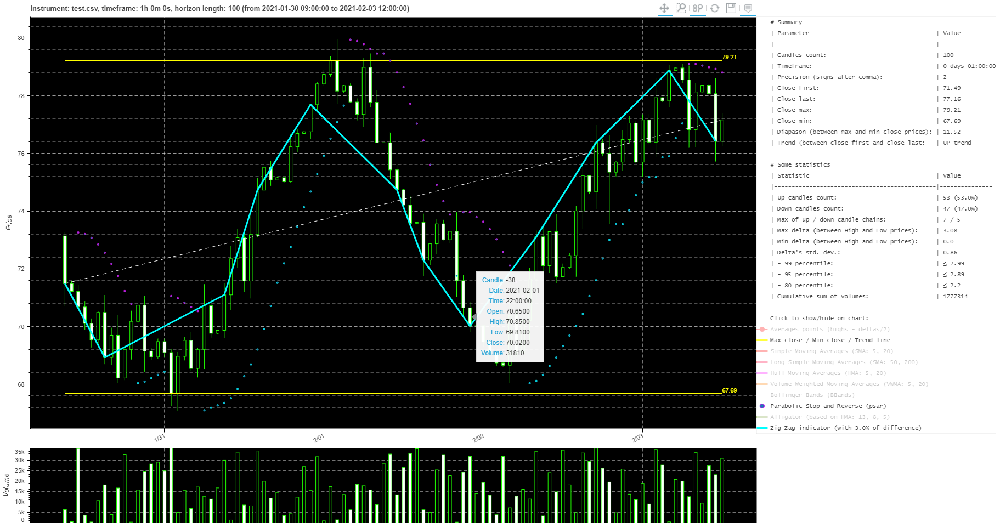
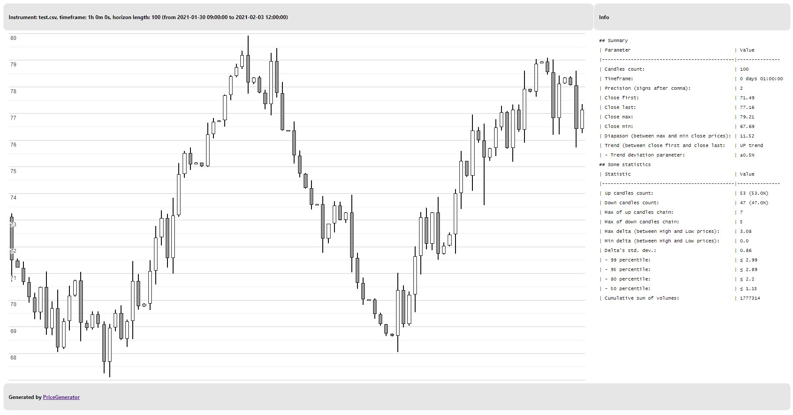
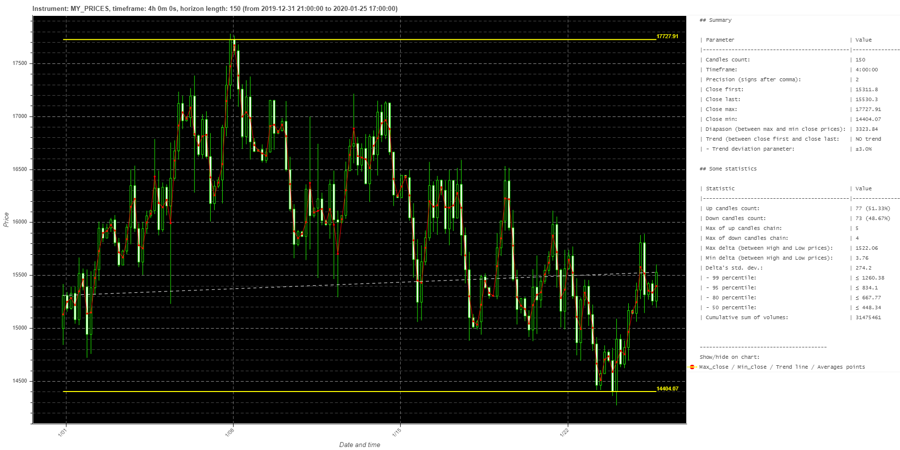
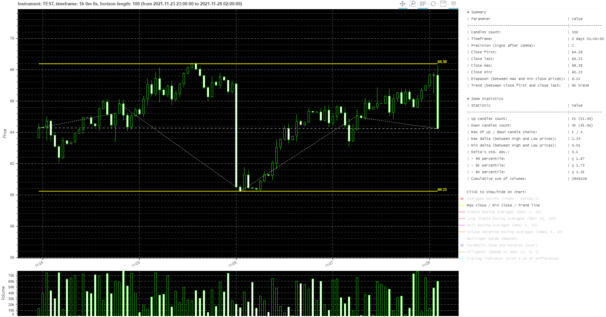

# PriceGenerator


Инструкция на английском здесь (see english readme here): https://github.com/Tim55667757/PriceGenerator/blob/master/README.md

[](https://travis-ci.com/Tim55667757/PriceGenerator)
[](https://pypi.python.org/pypi/PriceGenerator)
[](https://github.com/Tim55667757/PriceGenerator/blob/master/LICENSE)

**Содержание**

1. [Введение](#Введение)
   - [Метод генерации цен](#Метод-генерации-цен)
2. [Как установить](#Как-установить)
3. [Примеры использования](#Примеры-использования)
   - [Из командной строки](#Из-командной-строки)
     - [Справка](#Справка)
     - [Генерация цен с параметрами по умолчанию](#Генерация-цен-с-параметрами-по-умолчанию)
     - [Генерация цен, получение статистики и отрисовка графика](#Генерация-цен-получение-статистики-и-отрисовка-графика)
     - [Статистика и график из сохранённых цен](#Статистика-и-график-из-сохранённых-цен)
     - [Статистика и график на упрощённом шаблоне](#Статистика-и-график-на-упрощённом-шаблоне)
     - [Переопределение параметров](#Переопределение-параметров)
     - [Разделение данных по трендам](#Разделение-данных-по-трендам)
   - [Через импорт модуля](#Через-импорт-модуля)


## Введение

Иногда для целей тестирования автоматизированных торговых алгоритмов бывает необходимо получить набор данных с биржевыми ценами. Обычно трейдеры и аналитики используют модель цен вида OHLCV-candlesticks (open, high, low, close, volume), так называемые японские свечи. Одна строка таких данных представляет собой набор цен для построения одной японской свечи: дата открытия, цена открытия, наибольшая цена, наименьшая цена, цена закрытия на данном временном интервале и значение объёма торгов.

**PriceGenerator** — это простая библиотека, которую можно использовать как python-модуль или запускать из командной строки и генерировать случайные ценовые данные, максимально похожие на "настоящие цены", но с заранее заданными статистическими характеристиками. Можно задать интервал цен, таймфрейм, максимальное и минимальное значения для диапазона цен, максимальный размер для свечей, вероятность направления для очередной свечи, вероятность ценовых выбросов, количество генерируемых свечей и некоторые другие параметры.

Для дальнейшего статистического анализа цен в python очень часто используют библиотеку Pandas. Цены, сохранённые в виде Pandas DataFrame, могут выглядеть как-то так:
```text
                    datetime   open   high    low  close  volume
95 2021-02-03 11:00:00+03:00  76.82  78.43  76.21  78.13   33652
96 2021-02-03 12:00:00+03:00  78.13  78.37  78.12  78.36    9347
97 2021-02-03 13:00:00+03:00  78.36  78.40  78.05  78.07   27250
98 2021-02-03 14:00:00+03:00  78.07  78.61  75.72  76.42   22979
99 2021-02-03 15:00:00+03:00  76.42  77.37  76.25  77.16   30845
```

Библиотека PriceGenerator позволяет:
- сохранить сгенерированные цены в .csv-формате (пример: [./media/test.csv](./media/test.csv));
- сохранить сгенерированные цены в переменную формата Pandas DataFrame для дальнейшего использования в скриптах автоматизации;
- автоматически рассчитать некоторые статистические и вероятностные характеристики сгенерированных цен и сохранить их в markdown-формате (пример: [./media/index.html.md](./media/index.html.md));
- загрузить цены реальных инструментов по модели OHLCV-candlesticks из .csv-файла и провести их статистический анализ;
- нарисовать график сгенерированных или загруженных реальных цен и сохранить его в html-формате (пример: [./media/index.html](./media/index.html));
  - сгенерированные цены, график и некоторые данные о поведении цен можно сохранить в виде обычной png-картинки (пример: [./media/index.html.png](./media/index.html.png)):

    

    Дополнительно на графике можно включить отображение некоторых популярных индикаторов (скользящие средние, полосы Боллинджера, ZigZag и другие).

### Метод генерации цен

Генерация набора свечей заданной длины `horizon` происходит по следующему (упрощённому) алгоритму:
1. Определяется или случайным образом генерируется в заданном диапазоне [`minClose`, `maxClose`] цена открытия `open` первой свечи.
2. Случайным образом, в зависимости от значения вероятности направления очередной свечи `upCandlesProb` (по умолчанию 50%), определяется направление свечи. Если `random() ≤ upCandlesProb`, то будет генерироваться up-свеча (у которой `open ≤ close`), иначе будет генерироваться down-свеча (у которой `open > close`).
3. После определения направления значение `close` свечи случайным образом генерируется так, чтобы для получившегося "тела" свечи было справедливо `|open - close| ≤ maxCandleBody`.
4. Случайным образом, в зависимости от значения вероятности ценовых выбросов свечи `maxOutlier` (по умолчанию 3%), генерируются значения `high` и `low` свечи. Если `random() ≤ maxOutlier`, то будет генерироваться свеча с ценовыми выбросами: "хвосты" свечи могут получиться достаточно большими, что будет имитировать реальные ценовые "выбросы" на рынке. Если свеча без аномалий, то "хвосты" будут генерироваться в диапазоне не более половины тела свечи.
5. Значение `close` сгенерированной свечи становится значением цены открытия `open` следующей свечи.
6. Далее повторяются шаги 2-5 пока не будет сгенерирована вся цепочка цен заданной длины `horizon`.

Все параметры можно задать после инициализации экземпляра класса `PriceGenerator()`. Результат генерации цен сохраняется в переменной класса `prices` в формате Pandas DataFrame и может использоваться для дальнейшего анализа.


## Как установить

Проще всего использовать установку через PyPI:
```commandline
pip install pricegenerator
```

После этого можно проверить установку командой:
```commandline
pip show pricegenerator
```


## Примеры использования

### Из командной строки

#### Справка

Внутренняя справка по ключам:
```commandline
pricegenerator --help
```

Вывод:
```text
Запуск: python PriceGenerator.py [параметры] [одна или несколько команд]

Генератор биржевых цен. Генерирует цепочку японских свечей с заранее предопределёнными
параметрами, возвращает pandas dataframe или сохраняет цены как .csv-файл
в формате свечей OHLCV в каждой строке. Смотрите примеры здесь:
https://tim55667757.github.io/PriceGenerator

Возможные параметры командной строки:
  -h, --help            Показать эту подсказку и выйти
  --ticker TICKER       Параметр: название тикера, 'TEST' по умолчанию.
  --precision PRECISION
                        Параметр: кол-во знаков после запятой, 2 по умолчанию.
  --timeframe TIMEFRAME
                        Параметр: разница между двумя соседними свечами
                        в минутах, 60 (или 1 час) по умолчанию.
  --start START         Параметр: дата и время первой свечи в текстовом формате
                        'год-месяц-день часы:минуты', например '2021-01-02 12:00'.
  --horizon HORIZON     Параметр: количество загружаемых или генерируемых свечей.
  --split-trend SPLIT_TREND
                        Параметр: количество различных периодов, например
                        --split-trend=/\- означает, что нужно сгенерировать
                        три последовательных периода, где сначала цепочка свечей
                        образует восходящий тренд, затем нисходящий, и в конце
                        период без тренда. Используется с ключом --split-count key.
  --split-count SPLIT_COUNT [SPLIT_COUNT ...]
                        Параметр: устанавливает количество свечей в каждом периоде,
                        например --split-count 5 10 15 означает, что нужно
                        сгенерировать 3 тренда с 5, 10 и 15 свечами в каждой цепочке,
                        причём общая сумма свечей должна совпадать со значением ключа
                        --horizon. Используется с ключами --split-count и --horizon.
  --max-close MAX_CLOSE
                        Параметр: максимальная цена закрытия среди всех свечей.
  --min-close MIN_CLOSE
                        Параметр: минимальная цена закрытия среди всех свечей.
  --init-close INIT_CLOSE
                        Параметр: цена открытия первой свечи в цепочке равна
                        этому значению, как бы 'последней' цене закрытия.
  --max-outlier MAX_OUTLIER
                        Параметр: максимальное значение ценовых 'выбросов',
                        по умолчанию (max-close - min-close) / 10.
  --max-body MAX_BODY   Параметр: максимальный размер 'тела' свечей:
                        abs(open - close), по умолчанию max-outlier * 0.9.
  --max-volume MAX_VOLUME
                        Параметр: максимальный торговый объём одной свечи.
  --up-candles-prob UP_CANDLES_PROB
                        Параметр: число в отрезке [0; 1] означает вероятность того,
                        что очередная свеча будет вверх, 0.5 по умолчанию.
  --outliers-prob OUTLIERS_PROB
                        Параметр: число в отрезке [0; 1] это вероятность
                        ценовых 'выбросов' или 'хвостов', 0.03 по умолчанию.
  --trend-deviation TREND_DEVIATION
                        Параметр: относительное отклонение для определения тренда,
                        по умолчанию ±0.005. Нет тренда, если (1st_close -
                        last_close) / 1st_close <= trend-deviation.
  --sep SEP             Параметр: разделитель для csv-файла, если не указывать,
                        то будет определяться автоматически.
  --zigzag ZIGZAG       Параметр: относительное отклонение для определения точек
                        индикатора ZigZag, 0.03 по умолчанию (3%).
  --debug-level DEBUG_LEVEL
                        Параметр: уровень логирования для STDOUT,
                        например, 10 = DEBUG, 20 = INFO, 30 = WARNING,
                        40 = ERROR, 50 = CRITICAL.
  --load-from LOAD_FROM
                        Команда: загрузить .cvs-файл в Pandas dataframe. Также вы
                        можете нарисовать график цен, указав ключ --render-bokeh.
  --generate            Команда: сгенерировать цепочку свечей с предопределёнными
                        статистическими параметрами и сохранить историю цен
                        как pandas dataframe или .csv-файл, если ключ --save-to
                        будет указан. Также вы можете нарисовать график цен,
                        указав ключ --render-bokeh.
  --save-to SAVE_TO     Команда: сохранить сгенерированные или загруженные цены
                        в .csv-файл. Также вы можете нарисовать график цен,
                        указав ключ --render-bokeh.
  --render-bokeh RENDER_BOKEH
                        Команда: нарисовать цепочку свечей как интерактивный
                        график из библиотеки Bokeh. Перед командой вы должны задать 
                        ключи --load-from или --generate. Подробнее про Bokeh:
                        https://docs.bokeh.org/en/latest/docs/gallery/candlestick.html.
  --render-google RENDER_GOOGLE
                        Команда: нарисовать цепочку свечей на простом не интерактивном
                        графике из библиотеки Google Candlestick chart. Подробнее:
                        https://developers.google.com/chart/interactive/docs/gallery/candlestickchart
                        Перед командой вы должны задать ключи --load-from или
                        --generate.
```

#### Генерация цен с параметрами по умолчанию

Давайте попробуем сгенерировать случайные ценовые данные (ключ `--generate`) со всеми параметрами по умолчанию и сохранить их в файл `test.csv` (ключ `--save-to имя_csv_файла` ). Команда может выглядеть так:
```commandline
pricegenerator --debug-level 10 --generate --save-to test.csv
```

Должен получиться вывод логов примерно следующего содержания:
```text
PriceGenerator.py   L:605  DEBUG   [2021-01-31 17:52:49,954] =--==--==--==--==--==--==--==--==--==--==--==--==--==--==--==--==--==--==--==--=
PriceGenerator.py   L:606  DEBUG   [2021-01-31 17:52:49,954] PriceGenerator started: 2021-01-31 17:52:49
PriceGenerator.py   L:367  INFO    [2021-01-31 17:52:49,954] Generating prices...
PriceGenerator.py   L:368  DEBUG   [2021-01-31 17:52:49,954] - Ticker name: TEST
PriceGenerator.py   L:369  DEBUG   [2021-01-31 17:52:49,954] - Interval or timeframe (time delta between two neighbour candles): 1:00:00
PriceGenerator.py   L:370  DEBUG   [2021-01-31 17:52:49,954] - Horizon length (candlesticks count): 100
PriceGenerator.py   L:371  DEBUG   [2021-01-31 17:52:49,954] - Start time: 2021-01-31--17-00-00
PriceGenerator.py   L:372  DEBUG   [2021-01-31 17:52:49,955]   |-> end time: 2021-02-04--21-00-00
PriceGenerator.py   L:373  DEBUG   [2021-01-31 17:52:49,955] - Maximum of close prices: 79.21
PriceGenerator.py   L:374  DEBUG   [2021-01-31 17:52:49,955] - Minimum of close prices: 67.69
PriceGenerator.py   L:375  DEBUG   [2021-01-31 17:52:49,955] - Maximum of candle body sizes: 3.08
PriceGenerator.py   L:376  DEBUG   [2021-01-31 17:52:49,955] - Maximum of candle tails outlier sizes: 3.42
PriceGenerator.py   L:377  DEBUG   [2021-01-31 17:52:49,955] - Init close (1st open price in chain): 71.49
PriceGenerator.py   L:378  DEBUG   [2021-01-31 17:52:49,955] - Maximum of volume of one candle: 42340
PriceGenerator.py   L:379  DEBUG   [2021-01-31 17:52:49,955] - Probability that next candle is up: 50.0%
PriceGenerator.py   L:380  DEBUG   [2021-01-31 17:52:49,955] - Statistical outliers probability: 3.0%
PriceGenerator.py   L:397  INFO    [2021-01-31 17:52:49,958] Showing last 5 rows as pandas dataframe:
PriceGenerator.py   L:399  INFO    [2021-01-31 17:52:49,963]                     datetime   open   high    low  close  volume
PriceGenerator.py   L:399  INFO    [2021-01-31 17:52:49,963] 95 2021-02-03 11:00:00+03:00  76.82  78.43  76.21  78.13   33652
PriceGenerator.py   L:399  INFO    [2021-01-31 17:52:49,963] 96 2021-02-03 12:00:00+03:00  78.13  78.37  78.12  78.36    9347
PriceGenerator.py   L:399  INFO    [2021-01-31 17:52:49,963] 97 2021-02-03 13:00:00+03:00  78.36  78.40  78.05  78.07   27250
PriceGenerator.py   L:399  INFO    [2021-01-31 17:52:49,963] 98 2021-02-03 14:00:00+03:00  78.07  78.61  75.72  76.42   22979
PriceGenerator.py   L:399  INFO    [2021-01-31 17:52:49,963] 99 2021-02-03 15:00:00+03:00  76.42  77.37  76.25  77.16   30845
PriceGenerator.py   L:173  INFO    [2021-01-31 17:52:49,963] Saving [100] rows of pandas dataframe with columns: ['date', 'time', 'open', 'high', 'low', 'close', 'volume']...
PriceGenerator.py   L:174  DEBUG   [2021-01-31 17:52:49,963] Delimeter: ,
PriceGenerator.py   L:181  INFO    [2021-01-31 17:52:49,976] Pandas dataframe saved to .csv-file [./test.csv]
PriceGenerator.py   L:645  DEBUG   [2021-01-31 17:52:49,976] All PriceGenerator operations are finished success (summary code is 0).
PriceGenerator.py   L:650  DEBUG   [2021-01-31 17:52:49,976] PriceGenerator work duration: 0:00:00.022938
PriceGenerator.py   L:651  DEBUG   [2021-01-31 17:52:49,976] PriceGenerator work finished: 2021-01-31 17:52:49

Process finished with exit code 0
```

Также рядом будет сохранён файл `test.csv`, пример которого можно посмотреть здесь: [./media/test.csv](./media/test.csv).

#### Генерация цен, получение статистики и отрисовка графика

В следующем примере давайте не только сгенерируем файл с данными по ценам, но и получим некоторые статистические параметры цен, а также отрисуем цены на графике (ключ `--render-bokeh имя_html_файла`). Команда может быть примерно такой:
```commandline
pricegenerator --debug-level 20 --generate --save-to test.csv --render-bokeh index.html
```

В случае успеха вы получите вывод в лог, похожий на этот:
```text
PriceGenerator.py   L:367  INFO    [2021-01-31 18:00:31,711] Generating prices...
PriceGenerator.py   L:397  INFO    [2021-01-31 18:00:31,714] Showing last 5 rows of Pandas generated dataframe object:
PriceGenerator.py   L:399  INFO    [2021-01-31 18:00:31,719]                     datetime   open   high    low  close  volume
PriceGenerator.py   L:399  INFO    [2021-01-31 18:00:31,719] 95 2021-02-03 11:00:00+03:00  76.82  78.43  76.21  78.13   33652
PriceGenerator.py   L:399  INFO    [2021-01-31 18:00:31,719] 96 2021-02-03 12:00:00+03:00  78.13  78.37  78.12  78.36    9347
PriceGenerator.py   L:399  INFO    [2021-01-31 18:00:31,719] 97 2021-02-03 13:00:00+03:00  78.36  78.40  78.05  78.07   27250
PriceGenerator.py   L:399  INFO    [2021-01-31 18:00:31,719] 98 2021-02-03 14:00:00+03:00  78.07  78.61  75.72  76.42   22979
PriceGenerator.py   L:399  INFO    [2021-01-31 18:00:31,719] 99 2021-02-03 15:00:00+03:00  76.42  77.37  76.25  77.16   30845
PriceGenerator.py   L:173  INFO    [2021-01-31 18:00:31,719] Saving [100] rows of pandas dataframe with columns: ['date', 'time', 'open', 'high', 'low', 'close', 'volume']...
PriceGenerator.py   L:181  INFO    [2021-01-31 18:00:31,731] Pandas dataframe saved to .csv-file [./test.csv]
PriceGenerator.py   L:410  INFO    [2021-01-31 18:00:31,731] Rendering pandas dataframe as Bokeh chart...
PriceGenerator.py   L:300  INFO    [2021-01-31 18:00:31,740] Some statistical info:
## Summary

| Parameter                                    | Value
|----------------------------------------------|---------------
| Candles count:                               | 100
| Timeframe:                                   | 1:00:00
| Precision (signs after comma):               | 2
| Close first:                                 | 71.49
| Close last:                                  | 77.16
| Close max:                                   | 79.21
| Close min:                                   | 67.69
| Diapason (between max and min close prices): | 11.52
| Trend (between close first and close last:   | UP trend
| - Trend deviation parameter:                 | ±0.5%

## Some statistics

| Statistic                                    | Value
|----------------------------------------------|---------------
| Up candles count:                            | 53 (53.0%)
| Down candles count:                          | 47 (47.0%)
| Max of up candles chain:                     | 7
| Max of down candles chain:                   | 5
| Max delta (between High and Low prices):     | 3.08
| Min delta (between High and Low prices):     | 0.0
| Delta's std. dev.:                           | 0.86
| - 99 percentile:                             | ≤ 2.99
| - 95 percentile:                             | ≤ 2.89
| - 80 percentile:                             | ≤ 2.2
| - 50 percentile:                             | ≤ 1.15
| Cumulative sum of volumes:                   | 1777314
PriceGenerator.py   L:563  INFO    [2021-01-31 18:00:32,290] Pandas dataframe rendered as html-file [./index.html]

Process finished with exit code 0
```

После выполнения команды выше вы получите три файла:
- `test.csv` — файл в .csv-формате, который содержит случайный набор цен, похожих на настоящие (пример: [./media/test.csv](./media/test.csv));
- `index.html` — график цен и статистику, отрисованные при помощи библиотеки Bokeh и сохранённые в .html-файл (пример: [./media/index.html](./media/index.html));
- `index.html.md` — статистика в текстовом виде, сохранённая в маркдаун-формате (пример: [./media/index.html.md](./media/index.html.md)).

#### Статистика и график из сохранённых цен 

Если вам нужно получить статистику по уже сгенерированным или реальным ценам, вы можете просто загрузить файл (ключ `--load-from имя_csv_файла` ) и отрисовать график (ключ `--render-bokeh имя_html_файла`):
```commandline
pricegenerator --debug-level 20 --load-from test.csv --render-bokeh index.html
``` 

В результате выполнения команды вы получите аналогичный график в `index.html` и статистику в `index.html.md`.

#### Статистика и график на упрощённом шаблоне

В примерах выше вы можете использовать отображение цен на простом, не интерактивном графике цен. Для этого используется библиотека Google Candlestick chart и простейший jinja2 шаблон. Давайте опять загрузим цены (ключ `--load-from имя_csv_файла` ), но отрисуем график через Google библиотеку (ключ `--render-google имя_html_файла`):
```commandline
pricegenerator --debug-level 20 --load-from test.csv --render-google index_google.html
``` 

В результате выполнения команды вы получите график [./media/index_google.html](./media/index_google.html)) и статистику в markdown файле. Выглядеть он будет примерно так:



#### Переопределение параметров

Давайте изменим некоторые параметры по умолчанию, которые влияют на генерацию цен и нарисуем свой уникальный график:
```commandline
pricegenerator --debug-level 10 --ticker "MY_PRICES" --precision 2 --timeframe 240 --start "2020-01-01 00:00" --horizon 150 --max-close 18000 --min-close 14000 --init-close 15000 --max-outlier 1000 --max-body 500 --max-volume 400000 --up-candles-prob 0.48 --outliers-prob 0.05 --trend-deviation 0.03 --zigzag 0.03 --generate --render-bokeh index_custom.html
``` 

Параметры означают:
- `--ticker "MY_PRICES"` — установить название графика для ценовой последовательности как MY_PRICES;
- `--precision 2` — установить точность, то есть количество знаков после запятой;
- `--timeframe 240` — одна свеча должна отражать изменение цен за 4 часа (240 минут);
- `--start "2020-01-01 00:00"` — дата и время первой свечи 2020-01-01 00:00;
- `--horizon 150` — сгенерировать 150 свечей;
- `--max-close 18000` — максимальная цена закрытия у любой свечи должна быть не больше 18000;
- `--min-close 14000` — минимальная цена закрытия у любой свечи должна быть не больше 14000;
- `--init-close 15000` — цена закрытия "предыдущей" и, соответственно, цена открытия первой генерируемой свечи должна быть равной 15000;
- `--max-outlier 1000` — если у свечи есть "выбросы" и "хвосты" то они должны быть не больше чем 1000;
- `--max-body 500` — максимальный размер "тела" свечи должен быть не более 500;
- `--max-volume 400000` — максимальный объём торгов для каждой свечи должен быть не более 400000;
- `--up-candles-prob 0.48` — установить вероятность того, что очередная свеча будет вверх, равной 0.48 (48%);
- `--outliers-prob 0.05` — установить вероятность появления выбросов равной 0.05 (5%);
- `--trend-deviation 0.03` — для определения тренда относительное изменение цен закрытия первой и последней свечей должно отличаться на ±0.03 (3%);
- `--zigzag 0.03` — относительная разница между двумя точками ZigZag индикатора;
- `--generate` — запустить генерацию цен;
- `--render-bokeh index_custom.html` — сохранить сгенерированные цены в файл index_custom.html и открыть его в браузере.



В результате выполнения команды у вас получится свой уникальный график случайных цен с переопределёнными базовыми параметрами генератора. У нас получились вот такие артефакты:
- картинка с изображением цен [./media/index_custom.html.png](./media/index_custom.html.png);
- график цен и статистика [./media/index_custom.html](./media/index_custom.html);
- статистика в текстовом виде [./media/index_custom.html.md](./media/index_custom.html.md).

#### Разделение данных по трендам

Эта фича появилась начиная с дев-версии `pricegenerator>=1.2.dev53` и в релизных версиях, старше чем `pricegenerator>=1.2.56`.  

Появились два новых консольных ключа: `--split-trend` и `--split-count`. Эти ключи указывают на внешний вид цепочки мини-трендов и количество свечей в каждом тренде.

Ключ `--split-trend` показывает вид движения, например `--split-trend=/\-` означает, что будет сгенерирована такая цепочка свечей, что сначала тренд будет возрастающий в её первой части, затем тренд сменится на нисходящий, и в последней цепочке свечей тренда не будет.

Ключ `--split-count` устанавливает количество свечей в каждом мини-тренде, например `--split-count 5 10 15` означает, что в сгенерированной цепочке свечей будет три мини-тренда с 5, 10 и 15 свечами в каждом из них.

Чтобы понять, как это работает, попробуйте один из следующих примеров:

```commandline
pricegenerator --horizon 300 --render-bokeh index.html --split-trend=/\- --split-count 50 100 150 --generate
pricegenerator --horizon 300 --render-bokeh index.html --split-trend=\/\ --split-count 50 100 150 --generate
pricegenerator --horizon 300 --render-bokeh index.html --split-trend=\-/ --split-count 50 100 150 --generate
pricegenerator --horizon 100 --render-bokeh index.html --split-trend=/\/\ --split-count 20 30 30 20 --generate
```

Для последнего примера вы можете получить картинку движения цены, похожую на эту:




### Через импорт модуля

Давайте рассмотрим пример генерации цен с некоторыми изменёнными параметрами, сохраним их в Pandas DataFrame и нарисуем график. Просто сохраните и запустите следующий скрипт:
```python
from pricegenerator.PriceGenerator import PriceGenerator, uLogger
from datetime import datetime, timedelta

# Отключаем логирование, чтобы не мешалось:
uLogger.setLevel(0)

# --- Инициализируем экземпляр класса генератора и настраиваем некоторые параметры:
priceModel = PriceGenerator()
priceModel.precision = 1  # сколько знаков после запятой должно быть в сгенерированных ценах
priceModel.ticker = "MY_GENERATED_PRICES"  # произвольное имя (тикер) генерируемых цен
priceModel.timeframe = timedelta(days=1)  # временной интервал между генерируемыми свечами, 1 час по умолчанию
priceModel.timeStart = datetime.today()  # с какой даты начинать генерацию свечей, по умолчанию с текущего времени
priceModel.horizon = 60  # сколько сгенерировать свечей, их должно быть не меньше 5-ти, по умолчанию 100
priceModel.maxClose = 16000  # максимальная цена закрытия свечи во всей цепочке цен,
                             # по умолчанию генерируется случайно в интервале (70, 90), это немного похоже на цены USDRUB
priceModel.minClose = 13800  # минимальная цена закрытия свечи во всей цепочке цен,
                             # по умолчанию генерируется случайно в интервале (60, 70), это немного похоже на цены USDRUB
priceModel.initClose = 14400  # если цена указана, то она будет ценой close (как бы "предыдущей" свечи) и одновременно ценой open самой первой свечи в генерируемой цепочке.
                              # None по умолчанию означает, что цена open первой свечи будет сгенерирована случайно в интервале (minClose, maxClose)
priceModel.maxOutlier = 500  # Максимальное значение для ценовых выбросов "хвостов" у свечей.
                             # None по умолчанию означает, что выбросы будут не более чем на (maxClose - minClose) / 10
priceModel.maxCandleBody = 300  # Максимальное значение для размера тел свечей abs(open - close).
                                # None по умолчанию означает, что тело свечи может быть не более чем 90% от размера максимального выброса: maxOutlier * 90%
priceModel.maxVolume = 400000  # максимальное значение объёма торгов для одной свечи, по умолчанию берётся случайным образом из интервала (0, 100000)
priceModel.upCandlesProb = 0.46  # вероятность того, что очередная генерируемая свеча будет вверх, 50% по умолчанию
priceModel.outliersProb = 0.11  # вероятность того, что очередная генерируемая свеча будет иметь ценовой "выброс", 3% по умолчанию
priceModel.trendDeviation = 0.005  # колебание цены close первой и последней свечей для определения тренда. "NO trend" если разница меньше этого значения, по умолчанию ±0.005 или ±0.5%.
priceModel.zigzag = 0.05  # относительная разница между двумя точками ZigZag индикатора, 0.03 по умолчанию
priceModel._chartTitle = ""  # произвольный заголовок графика, обычно генерируется автоматически

# Цены пока не сгенерированы и не загружены, проверим это:
print("Current prices:\n{}".format(priceModel.prices))

# Запускаем генератор цен, при этом они будут сохранены
# в переменной priceModel.prices в формате Pandas DataFrame:
priceModel.Generate()

# Убеждаемся, что цены сгенерированы:
print("Generated prices as Pandas DataFrame:\n{}".format(priceModel.prices))

# Словарь с посчитанной статистикой сохраняется в переменную self.stat:
print("Dict with statistics:\n{}".format(priceModel.stat))

# Сохраняем OHLCV-цены в .csv-файл
priceModel.SaveToFile(fileName="test.csv")

# Сохраняем график цен в html-файл и сразу открываем его в браузере.
# Статистика в текстовом виде будет автоматически сохранена в markdown-файле с именем fileName + ".md".
priceModel.RenderBokeh(fileName="index.html", viewInBrowser=True)

# Вместо библиотеки Bokeh вы можете отрисовать цены на простом, не интерактивном графике,
# через библиотеку Google Candlestick chart. Просто раскомментируйте строчки ниже.
# Перед вызовом priceModel.RenderGoogle(), вы можете задать свой шаблон в переменной self.j2template
# priceModel.j2template = "google_template_example.j2"  # полный путь до шаблона или мультистроковая переменная с jinja2-шаблоном
# priceModel.RenderGoogle(fileName="index.html", viewInBrowser=True)
```

При запуске скрипта вы получите аналогичный вывод в логи, три файла: `test.csv`, `index.html` и `index.html.md`, а также html-файл с графиком цен будет сразу же открыт в браузере. Вы можете самостоятельно поэкспериментировать с параметрами класса `PriceGenerator()` для генерации цен подходящих под ваши условия.


Успехов вам в автоматизации и тестировании биржевой торговли! ;)